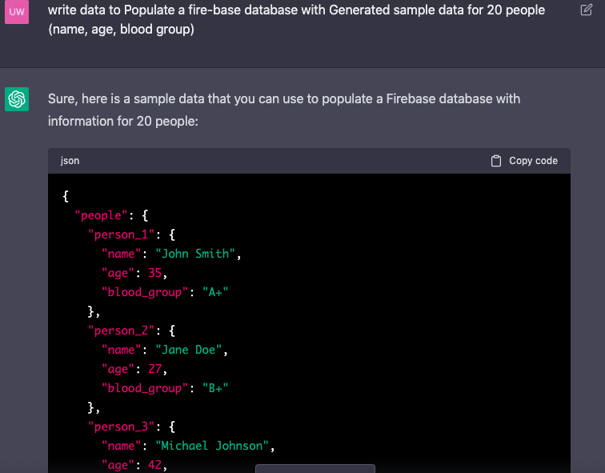

# Frontend Vuejs Assignment

This is a solution to the [Frontend Developer Assignment]

## Project setup
```
npm install
```

### Compiles and hot-reloads for development
```
npm run serve
```

### Compiles and minifies for production
```
npm run build
```

### Lints and fixes files
```
npm run lint
```

### Customize configuration
See [Configuration Reference](https://cli.vuejs.org/config/).


## Table of contents

- [Overview](#overview)
  - [The challenge](#the-challenge)
  - [Screenshot](#screenshot)
  - [Links](#links)
- [My process](#my-process)
  - [Built with](#built-with)
  - [Useful resources](#useful-resources)
- [Author](#author)

## Overview

This is a Vue.js component that displays a bar chart using Highcharts. The chart displays the distribution of people across different blood groups and age ranges. The bars of the chart indicate the number of people in each blood group, with the height of each bar representing the total number of individuals in that group. The bar for each age group is further divided into sub-bars, with each sub-bar representing the number of individuals in that age group and blood group.

The component imports the Highcharts Chart component and the PulseLoader component from vue-spinner, which is used to display a loading spinner while the chart is being loaded. The data for the chart is imported from a data.json file.

The component contains a chartOptions object that contains the configuration options for the Highcharts chart. The series array initially contains three empty data sets, one for each age group. The computed properties childrenData, youthData, and elderData are used to group the people based on their age ranges and return the data for the corresponding age groups.

The created hook is used to retrieve the data from Firestore and store it in local storage. If the data is already available in local storage, it is retrieved from there. The loaded data is used to set the value of the loaded data property to true. If the data is not available in local storage, it is retrieved from Firestore, and the loaded data is set to true once the data has been retrieved.

The groupData method is used to group the people based on their blood groups and return the number of people in each group. This method is used by the computed properties childrenData, youthData, and elderData to group the people based on their age ranges and return the data for the corresponding age groups.

### The challenge


The app should work well offline using local storage or index db to achieve this.
- Build a Vue app that pulls the data using API calls and visualizes this information using a barchart (from the high-chart library)
- Populate a fire-base database with Generated sample data for 20 people (name, age, blood group)
- The app should work well offline using local storage or index db to achieve this.
- The bar chart should show the number of people under each blood group and those with specific age ranges.


### Screenshot


## My process

### Built with

- Semantic HTML5 markup
- SaSS
- VueJS
- [Firebase](https://firebase.google.com/) - Database

**Note: These are just examples. Delete this note and replace the list above with your own choices**

### Example Process

To save time, the data for the patients was created using OpenAI's - [ChatGPT](https://chat.openai.com/) as seen below



This data was stored in a json file and was used to build the application statically, before the firestore was set-up and hooked up to the application.

The setDoc method was used easily push the data to the data base, rather than inputting it manually


see example below:

```js
const db = getFirestore(app);

const docRef = doc(db, "myCollection", "myDocumentID" );

const data = {
   My: "Data",
};

setDoc(docRef, data)
.then(() => {
    console.log("Document has been added successfully);
})
.catch(error => {
    console.log(error);
})
```


### Useful resources

- [Vue JS Docs](https://vuejs.org/guide/introduction.html) - 

## Author

- Website - [John Uwaishe](https://www.johnwav.space)
